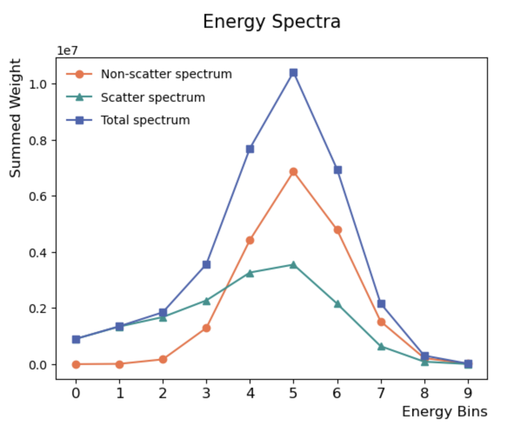
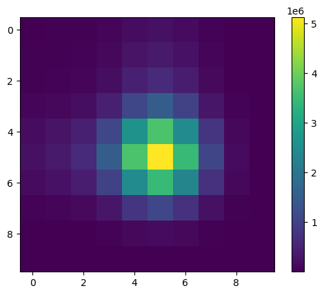

# Evaluation of Energy-based Scatter Estimation in Positron Emission Tomography

This repository contains the curated code, configuration files, selected results, and dissertation produced for my MSc Precision Medicine dissertation at University College London (UCL), 2024–25.

**Dissertation title:** Evaluation of Energy-based Scatter Estimation in Positron Emission Tomography  
**Module:** MEDC0088 Research Project  
**Candidate code:** MDDG5  
**Supervisor:** Kris Thielemans

[Read the dissertation (PDF)](./Dissertation%20MSc.pdf)

## Project overview

Positron emission tomography (PET) images are degraded by scattered photons. Conventional scatter correction methods, including single scatter simulation, rely on physical modelling and additional scanner information.

This project evaluates an energy-based scatter estimation method using Monte Carlo simulations. Energy spectra generated with SimSET were processed and reconstructed with STIR/SIRF, allowing the estimated unscattered and scattered components to be compared with simulation ground truth.

The results indicate that the unscattered photon component can be estimated with high precision, while estimation of the scattered component remains more sensitive to calibration and modelling assumptions.

## Repository contents

- `STIR&SimSET.ipynb` — main analysis notebook.
- `Dissertation MSc.pdf` — submitted MSc dissertation.
- `2.9.2/` — project-specific SimSET scripts and configuration templates.
- `STIR/` — STIR Git submodule pinned to the version used during the project.
- `stir-overrides/` — modified STIR/SimSET helper scripts used in the experiments.
- `scanner.hs` and `scanner.s` — scanner and projection-data files used by the notebook.
- `results/final-outputs-scatter-parameter-3.zip` — final selected SimSET outputs generated with `scatter_parameter=3`.
- `figures/` — selected figures illustrating the energy spectra and energy-bin analysis.

Large generated simulation directories, compiled binaries, temporary files, and duplicate archives are intentionally excluded from this repository.

## Selected figures

### Simulated energy spectra



### Energy-bin analysis



## Requirements

The workflow was developed using:

- Python and Jupyter Notebook
- NumPy
- Matplotlib
- SIRF, using the `sirf.STIR` Python interface
- STIR
- SimSET 2.9.2

SimSET is not redistributed in this repository and must be installed separately.

## Clone the repository

Clone the repository together with its STIR submodule:

```bash
git clone --recurse-submodules https://github.com/IanDing404/MDDG5.git
cd MDDG5
```

If the repository was cloned without its submodule, initialise it with:

```bash
git submodule update --init --recursive
```

The STIR submodule is pinned to commit:

```text
bfb4f82a4589dc8f77975ae44880094abd3d9640
```

## Apply the project-specific STIR scripts

The modified helper scripts are stored separately so that the upstream STIR repository remains identifiable as a Git submodule.

From the repository root:

```bash
cp stir-overrides/src/SimSET/examples/howto_run_SimSET.sh \
   STIR/src/SimSET/examples/

cp stir-overrides/src/SimSET/scripts/*.sh \
   STIR/src/SimSET/scripts/
```

## Configure SimSET

Set `SIMSET_DIR` to the location of your SimSET 2.9.2 installation:

```bash
export SIMSET_DIR="/path/to/SimSET/2.9.2"
```

The scripts check this environment variable before running and do not contain the original machine-specific absolute paths.

## Extract the selected results

```bash
unzip results/final-outputs-scatter-parameter-3.zip
```

Run the notebook from the repository root so that its relative paths resolve correctly:

```bash
jupyter notebook "STIR&SimSET.ipynb"
```

The complete original working directory included many gigabytes of generated Monte Carlo data. Those reproducible or intermediate outputs are not included in this curated repository.

## Third-party software

STIR is included as a Git submodule and remains subject to its upstream licence and attribution requirements.

SimSET must be obtained separately from its official distribution. Third-party reference publications used during the research are not redistributed here.
